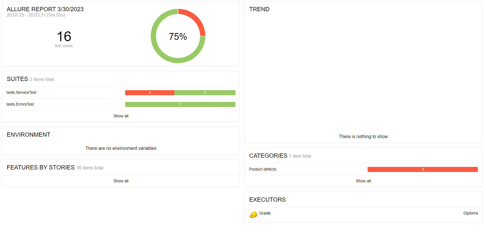

# Документ по итогам тестирования
## Краткое описание
С 20.03.2023 по 30.03.2023 тестировалось приложение для покупки билетов "Пушетествие дня"
Автоматизация проводилась с использованием:
- Java 11
- Junit-jupiter: 5.8.1
- Selenide: 5.19
- Allure-selenide: 2.16.1

# Тест-кейсы
**Количество:** 16
**Процент успешных:** 75%

# Найденные баги:
1. [Опечатка в слове "Марракеш"](https://github.com/Nikitajc1/Diploma/issues/1)
2. [Поле "Владелец" не обладает валидацией](https://github.com/Nikitajc1/Diploma/issues/2)
3. [Значение "000" в поле CVC/CVV проходит валидацию](https://github.com/Nikitajc1/Diploma/issues/3)
4. [Неверное значение amount в таблице БД "payment_entity"](https://github.com/Nikitajc1/Diploma/issues/4)
5. [Опечатка в описании путешествия](https://github.com/Nikitajc1/Diploma/issues/5)
6. [Значение "00" в поле "Месяц" проходит валидацию](https://github.com/Nikitajc1/Diploma/issues/6)
7. [Появляется двойное уведомление после ввода некорректной карты](https://github.com/Nikitajc1/Diploma/issues/7)

# Общие рекомендации

- Настроить валидацию полей: "Месяц", "Владелец", "CVC/CVV"
- Исправить орфографию
- Настроить верную передачу значений в БД
